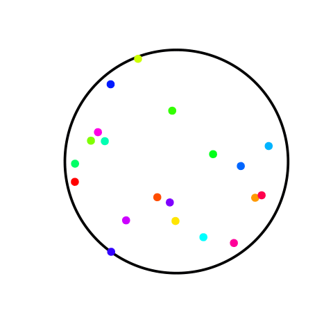

<!-- para alterar cor de fundo dos slides -->
<style>
.title-slide {
  background-color: #FFFFFF; /* #EDE0CF; #CA9F9D*/
}
</style>

<!-- Limit image width and height -->
<style type="text/css">
img {     
  max-height: 400px;     
  max-width: 450px; 
}
</style>

<!-- criando um estilo css que divide os slides em 3 colunas - bem util! -->
<!-- depois chamar com <div class ="col3"> (...) </div> -->
<!-- https://stackoverflow.com/questions/31753897/2-column-section-in-r-markdown -->
<style>
  .col2 {
    columns: 2 200px;         /* number of columns and width in pixels*/
    -webkit-columns: 2 200px; /* chrome, safari */
    -moz-columns: 2 200px;    /* firefox */
  }
  .col3 {
    columns: 3 100px;
    -webkit-columns: 3 100px;
    -moz-columns: 3 100px;
  }
</style>

## Movimento Browniano

```{r carregamento, echo=FALSE}
#workspace.loc<-file.choose()
load("./tabs_ggVis/tabs_work1.RData")
# pacote para tabelas
library(knitr)
# pacote para interação googleVis + libraries do slidify
#suppressPackageStartupMessages(library(googleVis))
```

Movimento Browniano como conhecemos:

<p><center>
</center></p>

--- &twocol  

## Movimento Browniano - Mercado Financeiro

*** =left

<p><center>
</center></p>

*** =right

<p><center>
</center></p>

--- .class #id 

## Exemplo Movimento Browniano - Mercado Financeiro

```{r echo = F, results = 'asis', message = F}
require(googleVis)
#library(slidifyLibraries)
#suppressPackageStartupMessages(library(googleVis))
# com message = F nas opções, não precisa de supressPackage...
g1 <- gvisMotionChart(bov.tab ,idvar="bond", timevar="data",
                      options=list(width=900, height=450))
print(g1, tag = "chart")

#plot(gvisMotionChart(bov.tab ,idvar="bond", timevar="data"))
                      #options=list(width=900, height=450))
#print(g1, tag = "chart")
```


--- .class #id 

## O que são Opções ?

<br>
<br>
<br>
<br>
<p><center>
<font color="gray" size="15" face="arial">
<strong><b>
Opções vs. Ações
<br>
<br>
Call vs. Put
</b></strong></font></center></p>


--- .class #id 

## Teoria - Movimento Browniano
<br/>

Um processo estocástico $\{ X(t), t \geq 0 \}$ com espaço de estados $S=R$ é Movimento Browniano se satisfaz:

<br>

1. $X(0) = 0$
2. $X(t)$ tem incrementos independentes e estacionários
3. $X(t+s) - X(s) \sim  N(0,t)$


--- .class #id  

## Teoria - Equação de Black-Scholes (1)

<div class="col3">

<p><center>
</center></p>

<p><center>
</center></p>

<p><center>
</center></p>

</div>


--- .class #id  

## Teoria - Equação de Black-Scholes (2)

<br>

<p style="font-size:40px">

$$
C_{o} = S_{o}N(d_{1}) - Xe^{-rT}N(d_{2})
$$
</p>

<p style="font-size:15px">
<div class="col2">
onde,
$$
d_{1} = \frac{\ln(\frac{S_{o}}{X}) + (r + \frac{\sigma^{2}}{2})T}{\sigma\sqrt{T}}
$$

$$
d_{2} = \frac{\ln(\frac{S_{o}}{X}) + (r - \frac{\sigma^{2}}{2})T}{\sigma\sqrt{T}}
$$
ou,
$$ 
d_{2} = d_{1} - \sigma\sqrt{T}
$$

\(S_{o} = \) preço da ação; <br/>

\(X = \) preço de exercício (strike); <br/>

\(r = \) taxa de juros "risk-free"; <br/>

\(T = \) tempo até expirar; <br/>

\(\sigma = \) desvio padrão dos retornos em escala log (volatilidade)

</div>
</p>


--- &twocol 

## Exemplo - Cálculo do preço de uma Opção Call (1)
<br>

*** =left
* Preço da ação \(S_{o}\): \($62,00\)
* Preço de exercício \(X\): \($62,00\)
* Tempo até expirar \(T\): $40$ dias $\rightarrow$ \(40/365\)
* Volatilidade \(\sigma\): \(32\% \rightarrow .32\)
* Taxa de juros "risk-free": \(4\% \rightarrow .4\)

*** =right

$$
d_{1} = \frac{\ln(\frac{62}{60}) + (0.4 +\frac{(.32)^{2}}{2})\frac{40}{365}} {.32\sqrt{\frac{40}{365}}} \approx 0.4
$$

$$
d_{2} = 0.404 - 0.32\sqrt{\frac{40}{365}} \approx 0.3
$$
$$ N(d_{1}) \approx 0.6554$$
$$ N(d_{2}) \approx 0.6179$$


--- .class #id 

## Exemplo - Cálculo do preço de uma Opção Call (2)
<br>

<p style="font-size:40px">

$$
C_{o} = S_{o}N(d_{1}) - Xe^{-rT}N(d_{2})
$$
</p>

<p style="font-size:20px">

$$
C_{o} = (62)(0.6554) - [(60)e^{-0.04(\frac{40}{365})}(0.6179)]
$$

$$
C_{o} = 40.63 - (59.74)(0.6179)
$$

$$
C_{o} = \$40.63 - \$36.91 = \$3.72
$$
</p>


--- .class #id 

## Obrigado!!!


