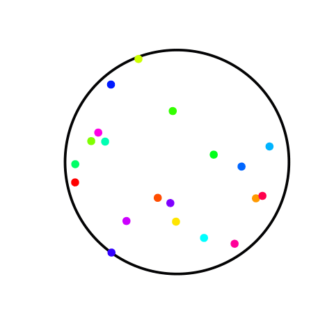

---
title       : Movimento Browniano e Mercado Financeiro
subtitle    : A Equação de Black-Scholes
author      : Caio Balena / Allan Vieira
job         : 
framework   : io2012        # {io2012, html5slides, shower, dzslides, ...}
highlighter : prettify  # {highlight.js, prettify, highlight}
hitheme     : tomorrow      # 
widgets     : [mathjax, bootstrap, quiz]            # {mathjax, quiz, bootstrap}
ext_widgets : #{rCharts: libraries/nvd3}
mode        : selfcontained # {standalone, draft}
knit        : slidify::knit2slides
assets      : {js: 'test.js'}
logo        : est_logo.png
biglogo     : unb_big_logo.png
--- dt:10

<!-- widgets bootstrap e quiz sao importantes para as tabs funcionarem -->

<!-- para alterar cor de fundo dos slides -->

<!-- Limit image width and height -->

<!-- criando um estilo css que divide os slides em 3 colunas - bem util! -->
<!-- depois chamar com 
 (...) 
 -->
<!-- https://stackoverflow.com/questions/31753897/2-column-section-in-r-markdown -->

## Movimento Browniano

Movimento Browniano como conhecemos:

--- &twocol  

## Movimento Browniano - Mercado Financeiro

*** =left

*** =right

--- {class: class, tpl: tabs}
## Exemplo Mov. Br. - Mercado Financeiro

*** {class: active, id: day}

<!-- MotionChart generated in R 3.4.2 by googleVis 0.6.2 package -->
<!-- Wed Nov 15 11:34:24 2017 -->

<!-- jsHeader -->

 
<!-- jsChart -->  

 
<!-- divChart -->
  

*** {id: intraday}

<!-- MotionChart generated in R 3.4.2 by googleVis 0.6.2 package -->
<!-- Wed Nov 15 12:34:00 2017 -->

<!-- jsHeader -->

 
<!-- jsChart -->  

 
<!-- divChart -->
  

--- .class #id 

## O que são Opções ?

> - Opções vs. Ações

> - Call vs. Put

--- .class #id  

## Black, Scholes (e Merton!!)

--- .class #id 

## Teoria - Movimento Browniano
 

Um processo estocástico $\{ X(t), t \geq 0 \}$ com espaço de estados $S=R$ é Movimento Browniano se satisfaz:

 

> 1. $X(0) = 0$
> 2. $X(t)$ tem incrementos independentes e estacionários
> 3. $X(t+s) - X(s) \sim  N(0,t)$

--- .class #id  

## Teoria - Equação de Black-Scholes

$$
C_{o} = S_{o}N(d_{1}) - Xe^{-rT}N(d_{2})
$$

onde,
$$
d_{1} = \frac{\ln(\frac{S_{o}}{X}) + (r + \frac{\sigma^{2}}{2})T}{\sigma\sqrt{T}}
$$

$$
d_{2} = \frac{\ln(\frac{S_{o}}{X}) + (r - \frac{\sigma^{2}}{2})T}{\sigma\sqrt{T}}
$$
ou,
$$ 
d_{2} = d_{1} - \sigma\sqrt{T}
$$

\(S_{o} = \) preço da ação;  

\(X = \) preço de exercício (strike);  

\(r = \) taxa de juros "risk-free";  

\(T = \) tempo até expirar;  

\(\sigma = \) desvio padrão dos retornos em escala log (volatilidade)

--- &twocol 

## Exemplo - Cálculo do preço de uma Opção Call (1)
 

*** =left
* Preço da ação \(S_{o}\): \($62,00\)
* Preço de exercício \(X\): \($62,00\)
* Tempo até expirar \(T\): $40$ dias $\rightarrow$ \(40/365\)
* Volatilidade \(\sigma\): \(32\% \rightarrow .32\)
* Taxa de juros "risk-free": \(4\% \rightarrow .4\)

*** =right

$$
d_{1} = \frac{\ln(\frac{62}{60}) + (0.4 +\frac{(.32)^{2}}{2})\frac{40}{365}} {.32\sqrt{\frac{40}{365}}} \approx 0.4
$$

$$
d_{2} = 0.404 - 0.32\sqrt{\frac{40}{365}} \approx 0.3
$$
$$ N(d_{1}) \approx 0.6554$$
$$ N(d_{2}) \approx 0.6179$$

--- .class #id 

## Exemplo - Cálculo do preço de uma Opção Call (2)
 

$$
C_{o} = S_{o}N(d_{1}) - Xe^{-rT}N(d_{2})
$$

$$
C_{o} = (62)(0.6554) - [(60)e^{-0.04(\frac{40}{365})}(0.6179)]
$$

$$
C_{o} = 40.63 - (59.74)(0.6179)
$$

$$
C_{o} = \$40.63 - \$36.91 = \$3.72
$$

--- .class #id 

## Obrigado!!!

